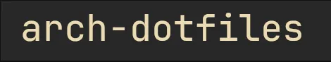
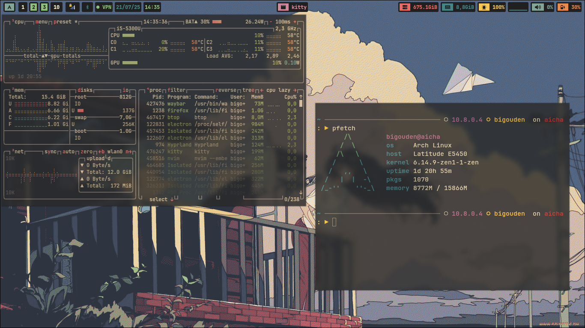
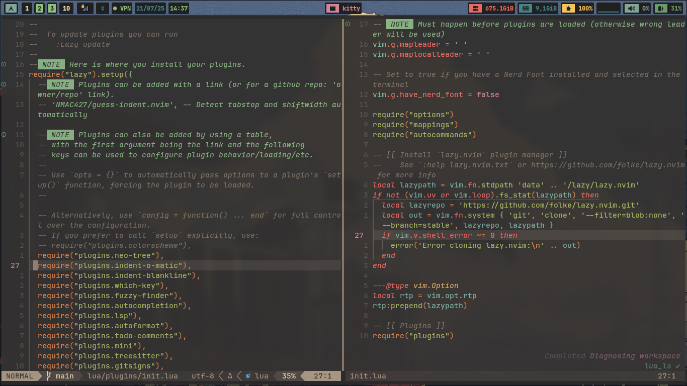
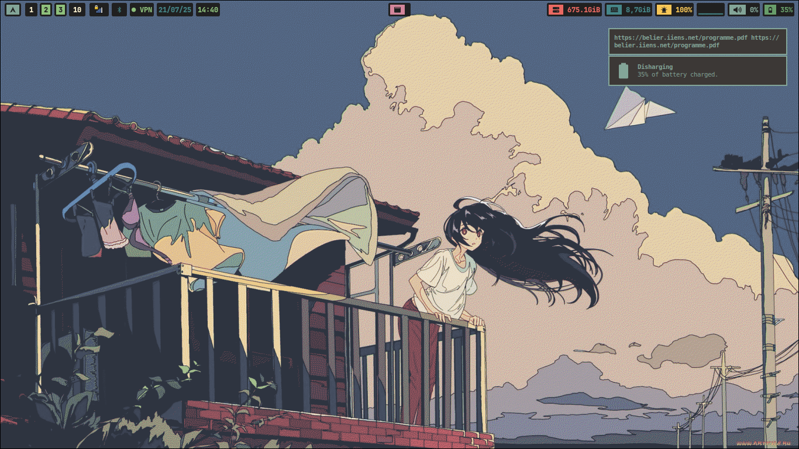

<div align="center">
    </img> </br>
    
    </img>
    <a href="https://belier.iiens.net"></img></a>
    
    <p>
    My personal dotfiles managed with <a href="https://www.gnu.org/software/stow/">stow</a>
    </p>
</div>

---

## Sommaire

* [Screenshots](#screenshots)
* [Objectifs](#objectifs)
  * [Ressources](#ressources)
  * [Interface Utilisateur](#interface-utilisateur-ui)
  * [Expérience Utilisateur](#expérience-utilisateur-ux)
* [Choix Techniques](#choix-techniques)
* [Applications installées](#applications-installées)
* [Configuration des outils](#configuration-des-outils)
* [Scripts personnalisés](#scripts-personnalisés)
* [Gestion des dotfiles avec Stow](#gestion-des-dotfiles-avec-stow)
* [Liens utiles](#liens-utiles)

---

## Screenshots





---

## Objectifs

Créer un OS personnalisé et léger, optimisé pour les besoins quotidiens et le développement, avec une forte attention à la cohérence visuelle et l'expérience utilisateur fluide.

### Ressources

* Optimisation de la consommation batterie, RAM, CPU, GPU
* Utilisation minimale des ressources
* Arch choisi pour sa flexibilité malgré une complexité légèrement supérieure

### Interface Utilisateur (UI)

Thèmes cohérents à travers tout le système et les apps :

* dark / light
* Catppuccin
* Gruvbox
* Tokyo Night

Support complet dans : shell, terminal, file manager, etc.

### Expérience Utilisateur (UX)

* Gestion graphique du réseau, VPN, écrans, fond d'écran
* Tiling WM avec fallback automatique en floating pour les apps GUI
* Fenêtres flottantes par défaut pour éviter les bugs de rendu

---

## Choix techniques

* **Distro** : Arch Linux
* **Window Manager** : Hyprland (Wayland)
* **Login Manager** : SDDM (custom theme astronaut)
* **Bootloader** : GRUB + thème custom
* **Shell** : Zsh avec Oh-My-Zsh et Starship
* **Package Management** : pacman, paru (AUR helper)
* **Dev isolation** : devcontainers, distrobox
* **Dotfile management** : Stow

---

## Applications installées

<center>

| Catégorie          | Application                                               |
| ------------------ | --------------------------------------------------------- |
| Kernel             | Linux / Linux-Zen (VirtualBox)                            |
| Terminal           | Kitty, Starship, Tmux                                     |
| Shell              | Zsh, zsh-autosuggestions, zsh-syntax-highlighting, ble.sh |
| File manager (TUI) | Yazi                                                      |
| File manager (GUI) | Dolphin                                                   |
| Editor             | Neovim, Vim, Helix                                        |
| IDE                | Vscode (télémetrie désactivée)                            |
| Menu               | Rofi (remplace Fuzzel), Jgmenu                            |
| Notifications      | Dunst                                                     |
| Bar                | Waybar + modules custom (VPN, updates, RAM)               |
| Screenshots        | Hyprshot, hyprshotgun, hyprshotgui                        |
| Wallpaper          | Hyprpaper, `change_wallpaper`, `wallpaper_menu`           |
| Color picker       | Hyprpicker                                                |
| Cursor             | Hyprcursor, reset script inclus                           |
| VPN                | Wireguard, OpenVPN + intégration Waybar                   |
| Network            | NetworkManager, network-manager-applet, Blueman           |
| Display            | nwg-displays                                              |
| GTK theme          | nwg-look                                                  |
| Audio              | MPV, Playerctl, lofi (script)                             |
| Clipboard          | Clispe                                                    |
| Theme              | Catppuccin, Gruvbox, TokyoNight                           |
| Browser            | Firefox + PywalFox, LibreWolf, WebCord                    |
| PDF                | Zathura                                                   |
| Password manager   | Bitwarden (via `rbw-rofi`)                                |
| System info        | Neofetch, macchina                                        |
| Zoom WM            | Hypr-zoom                                                 |
| Shader             | Hyprshade                                                 |
| Calculator         | rofi-calc                                                 |
| Report editor      | Latex (devcontainer), Typst (TODO)                        |
| Markdown preview   | Neovim plugin                                             |
| Others             | Vesktop, Syncthing, Obsidian                              |


</center>

---

## Configuration des outils

### Mise en place et installation

Arch installé en suivant le wiki officiel avec l’utilitaire `archinstall`. Les manipulations post-install sont réalisées directement après, y compris partitionnement, utilisateur, réseau, système de fichiers, etc.

### Customisation

#### GRUB (bootloader)

Installation d’un thème graphique pour GRUB. Le thème est placé dans `/usr/share/grub/themes/` puis déclaré dans `/etc/default/grub` :

```bash
GRUB_THEME="/usr/share/grub/themes/nom-du-theme/theme.txt"
```

> 💡 Un script futur permettra de changer dynamiquement le thème.

> ⚠️ Pensez à regénérer GRUB après modification :
>
> ```bash
> sudo grub-mkconfig -o /boot/grub/grub.cfg
> ```

#### SDDM (login manager)

Utilisé pour la connexion graphique. Personnalisé avec `sddm-astronaut-theme` (dynamiques et statiques).

* Paquets requis : `sddm qt6-svg qt6-virtualkeyboard qt6-multimedia-ffmpeg`
* Copier les fichiers du thème dans `/usr/share/sddm/themes`
* Ajouter les polices nécessaires dans `/usr/share/fonts`

Configurer `/etc/sddm.conf` :

```ini
[Theme]
Current=sddm-astronaut-theme

[General]
InputMethod=qtvirtualkeyboard
```

Changer le fond via `metadata.desktop` :

```ini
ConfigFile=Themes/le-theme-a-choisir.conf
```

#### Hyprpaper (wallpaper manager)

Installation :

```bash
sudo pacman -S hyprpaper
```

Configurer `~/.config/hypr/hyprpaper.conf` :

```ini
preload = ~/wallpapers/image1.png
wallpaper = eDP-1,~/wallpapers/image1.png
splash = true
```

Exécution au démarrage dans `hyprland.conf` :

```ini
exec-once = hyprpaper
```

Désactiver le fond par défaut d'Hyprland :

```ini
misc {
  force_default_wallpaper = 1
  disable_hyprland_logo = true
}
```

Scripts associés : `change_wallpaper`, `wallpaper_menu` (rofi)

#### Paru (AUR helper)

Installation :

```bash
sudo pacman -S --needed base-devel
git clone https://aur.archlinux.org/paru.git
cd paru
makepkg -si
```

Exemples :

* `paru` : mise à jour complète
* `paru -Sua` : mise à jour des paquets AUR

#### Scratchpad (fenêtres temporaires)

Utilisation de `scratchpad` via [Hyprland contrib](https://github.com/hyprwm/contrib)

* Dépendances : `jq`, `rofi`
* Keybinds dans `hyprland.conf` :

```ini
bind = $mainMod, code:20, exec, scratchpad
bind = $mainMod SHIFT, code:20,exec,  scratchpad -g
```

#### Hyprzoom

Zoom fluide sur écran :

```bash
paru hypr-zoom
```

Keybinds :

```ini
bind = $mainMod, code:21, exec, hypr-zoom -easing=InOutExpo -duration=100 -steps=50 -target=2
bind = $mainMod SHIFT, mouse:272, exec, hypr-zoom -easing=InOutExpo -duration=100 -steps=50 -target=2
```

#### Zsh / Bash / Starship / Kitty

> Documentation détaillée incluse dans les fichiers `.zshrc`, `.bashrc`, `starship.toml`, `kitty.conf`.

* Bash → `oh-my-bash`, `ble.sh`, aliases custom dans `.oh-my-bash/custom`
* Zsh → `oh-my-zsh`, plugins (rbw, zsh-autosuggestion, syntax-highlighting), thème `catppuccin`
* Starship → Prompt multi-thème (Gruvbox, Catppuccin)
* Kitty → Ligatures, emojis, thème dynamique depuis `theme.conf`


#### Vim (Configuration secondaire)

Plugin Manager : vim-plug
Utilisé via :

```vim
call plug#begin('~/.vim/plugged')
```

Thèmes :
- gruvbox
- catppuccin

```vim
colorscheme gruvbox
" ou
colorscheme catppuccin
```


Fichiers de config :
-dot-vimrc
- plugins.vim, plugin-config.vim
- autoload/plug.vim → installé automatiquement

Vim reste ici un éditeur de secours ou d’appoint, avec une config plus simple que Neovim.


#### Neovim

Neovim est configuré comme un IDE complet, modulaire et esthétique, reposant sur `lazy.nvim` pour la gestion dynamique des plugins. L'ensemble de la configuration est écrit en Lua et suit une architecture modulaire claire. Tous les fichiers de configuration sont localisés dans `~/.config/nvim/`.

##### Plugin manager

- `lazy.nvim` : gestionnaire de plugins moderne, asynchrone, supportant le lazy-loading.
- Plugins déclarés dans `lua/plugins/`, chacun dans un fichier dédié.

##### Plugins installés

### Plugins installés


| Activé | Plugin                    | Fonction principale                                                     |
|:--------:|---------------------------|--------------------------------------------------------------------------|
| x| `autocompletion.lua`      | Autocomplétion contextuelle via nvim-cmp et ses sources                 |
| x      | `gitsigns.lua`            | Signes git dans la marge                                                |
| x      | `java.lua`                | Configuration LSP spécifique pour Java                                  |
| x      | `mini.lua`                | Collection de modules Lua minimalistes pour l'UI                        |
| x      | `persistence.lua`         | Sauvegarde/restauration des sessions                                    |
| x      | `todo-comments.lua`       | Highlight et gestion des TODO/FIXME/NOTE                                |
| x      | `wakatime.lua`            | Suivi du temps de développement avec Wakatime                           |
| x      | `autoformat.lua`          | Formatage automatique selon le langage                                  |
| x      | `harpoon.lua`             | Gestion rapide de fichiers/buffers favoris                              |
|        | `latex.lua`               | Support LaTeX (non activé)                                              |
|        | `mkdir.lua`               | Création automatique de dossiers au save                                |
| x      | `pineapple.lua`           | Intégration du thème Pineapple                                          |
| x      | `toggleterm.lua`          | Terminal flottant intégré à Neovim                                      |
|        | `barbar.lua`              | Onglets de buffers style tabs (non activé)                              |
| x      | `hlsearch.lua`            | Amélioration de la recherche visuelle                                   |
| x      | `lazygit.lua`             | Intégration de LazyGit en terminal                                       |
|        | `neaterm.lua`             | Terminal alternatif flottant (non activé)                               |
|        | `pineapple-theme.lua`     | Thème Pineapple (complément)                                            |
| x      | `treesitter.lua`          | Coloration syntaxique avancée                                           |
|        | `colorscheme.lua`         | Gestion centralisée des couleurs                                        |
| x      | `indent-blankline.lua`    | Indentation visuelle par ligne                                          |
| x      | `lsp.lua`                 | Configuration des serveurs LSP                                          |
| x      | `neo-tree.lua`            | Explorateur de fichiers moderne                                         |
| x      | `presence.lua`            | Intégration Discord Rich Presence                                       |
| x      | `typst-preview.lua`       | Preview live des fichiers Typst                                         |
| x      | `dashboard.lua`           | Page d'accueil au démarrage de Neovim                                   |
| x      | `indent-o-matic.lua`      | Détection automatique des indentations                                  |
| x      | `lualine.lua`             | Barre de statut personnalisée                                           |
| x      | `noice.lua`               | Interface pour messages, commandes, LSP                                 |
|        | `scrollbar.lua`           | Barre de défilement visible (non activé)                                |
| x      | `url-open.lua`            | Ouvre les URL depuis Neovim                                             |
| x      | `fuzzy-finder.lua`        | Configuration de Telescope pour la recherche floue                      |
| x      | `init.lua`                | Chargement central de tous les plugins                                  |
| x      | `markdown-preview.lua`    | Aperçu live des fichiers Markdown                                       |
| x      | `nvim-dev-container.lua`  | Support des DevContainers (Docker)                                      |
|        | `smear-cursor.lua`        | Animation du curseur (non activé)                                       |
| x      | `url-view.lua`            | Liste les URL du buffer et les ouvre dans le navigateur                 |
| x      | `which-key.lua`           | Affiche les raccourcis disponibles                                      |


##### LSP et autocomplétion

LSP gérés avec `mason` et configurés via `lspconfig`. L’autocomplétion est assurée par `nvim-cmp` avec support des sources :
- LSP (via `cmp-nvim-lsp`)
- Snippets (via `luasnip`)
- Buffers, chemins, ligne de commande

##### Keybinds essentiels

| Raccourci            | Fonction                                         |
|----------------------|--------------------------------------------------|
| `<leader>ff`         | Recherche de fichier avec Telescope              |
| `<leader>lg`         | Recherche texte globale (ripgrep)               |
| `<leader>fb`         | Liste des buffers ouverts                        |
| `<leader>fr`         | Fichiers récents                                 |
| `<leader>rn`         | Renommage symbol (LSP)                           |
| `<leader>ca`         | Code action (LSP)                                |
| `<leader>e`          | Ouvrir la fenêtre de diagnostics                 |
| `gd` / `gr`          | Aller à la définition / références (LSP)         |
| `<leader>tt`         | Ouvrir le terminal intégré                       |
| `<leader>q`          | Fermer le buffer actuel                          |
| `<leader>qq`         | Quitter Neovim                                   |


##### Thèmes

Thèmes utilisés :
- `catppuccin` (mocha, frappe, latte, macchiato)
- `gruvbox`

Le thème actif est défini dans `colorscheme.lua` ou `theme.lua`, et synchronisé avec le terminal (Kitty), le shell (Zsh + Starship), et Waybar pour une apparence cohérente.

##### Structure de configuration

| Fichier ou dossier          | Rôle                                               |
|-----------------------------|----------------------------------------------------|
| `init.lua`                  | Point d’entrée principal                           |
| `lua/options.lua`           | Configuration des options de base                  |
| `lua/mappings.lua`          | Définition des raccourcis clavier globaux         |
| `lua/autocommands.lua`      | Autocommandes personnalisées                       |
| `lua/plugins/`              | Dossier contenant la config individuelle de plugins|
| `after/plugin/theme.lua`    | Application du thème actif                         |
| `lazy-lock.json`            | Fichier de verrouillage des plugins                |


#### Wireguard (VPN)

* Config dans `/etc/wireguard/wg0.conf`
* Script toggle via `nmcli` intégré à Waybar : `vpn_toggle.sh`
(voir [vpn\_toggle script](#vpn\_toggle.sh-avec-NetworkManager))

Waybar JSON module :

```json
"custom/vpn": {
  "format": "{}",
  "exec": "~/.config/waybar/scripts/vpn_toggle.sh status",
  "on-click": "~/.config/waybar/scripts/vpn_toggle.sh toggle"
}
```

Style CSS :

```css
#custom-vpn.on { color: #8ec07c; }
#custom-vpn.off { color: #ea6962; }
```

#### nwg-look / nwg-displays

* `nwg-displays` : gestion multi-moniteur (avec `monitors.conf` dans Hypr)
* `nwg-look` : personnalisation GTK

#### Zoxide (alternative à cd)

```bash
sudo pacman -S zoxide
zoxide init zsh --cmd cd >> ~/.config/zsh/.zshrc
```


#### Kitty (Terminal)

Kitty est configuré pour supporter les ligatures, les emojis, et le chargement dynamique de thèmes. Les fichiers sont dans `~/.config/kitty/` :

* `kitty.conf` : inclut `theme.conf`
* `theme.conf` : charge le thème actuel (Catppuccin, Gruvbox, etc.)

**Exemple :**

```conf
include theme.conf
font_family FiraCode Nerd Font
```


#### Hypr\* Tools

Les outils `hypr*` intégrés sont conçus spécifiquement pour Hyprland :

* **Hyprpaper** : pour le fond d’écran, léger et Wayland-native
* **Hyprzoom** : effet de zoom fluide (bind `SUPER+=`)
* **Hyprshot / hyprshotgun / hyprshotgui** : captures d’écran variées
* **Hyprcursor** : personnalisation du curseur
* **Hyprshade** : appliquer un shader/filtre
* **Hyprlock** : écran de verrouillage esthétique et léger

#### vpn\_toggle.sh avec NetworkManager

Le script `vpn_toggle.sh` a été modifié pour fonctionner avec `nmcli` au lieu de `wg-quick`. Cela rend le VPN toggle compatible avec les connexions VPN gérées dans NetworkManager (`nm-connection-editor`).

**Extrait :**

```bash
if nmcli con show --active | grep -q "$VPN_NAME"; then
    nmcli con down id "$VPN_NAME"
else
    nmcli con up id "$VPN_NAME"
fi
```

Cela permet de facilement activer/désactiver le VPN depuis la Waybar tout en profitant de l’intégration avec l’environnement graphique.

#### Dunst

Dunst est le gestionnaire de notifications utilisé ici. Léger et compatible Wayland, il est configuré dans `~/.config/dunst/dunstrc`.

* Personnalisation de la couleur, taille, position, transparence
* Notifications visuelles intégrées dans l’esthétique globale (Catppuccin / Gruvbox)
* Peut être couplé avec des raccourcis ou Waybar

#### Rofi

Remplaçant de Fuzzel, Rofi est utilisé comme lanceur d’applications et menu système (power menu, wallpaper, keybinds).

* Thématisé pour correspondre à l’apparence globale
* Script `wallpaper_menu`, `power_menu`, `scratchpad -g` utilisent tous Rofi

#### Hyprshot

Utilitaire de capture d’écran moderne pour Wayland.

* `hyprshot` : en ligne de commande
* `hyprshotgui` : interface graphique
* `hyprshotgun` : style shotgun CLI

Paru depuis AUR :

```bash
paru hyprshot-git
```

#### Tmux

Multiplexeur de terminal avec configuration légère. Permet :

* Sessions détachables
* Splits horizontaux/verticaux
* Gestion de projets persistants

#### Stow

Outil GNU utilisé pour gérer les dotfiles de façon modulaire.

* Tous les fichiers sont rangés dans `config/`
* Script `stow.sh` pour (dé)lier automatiquement chaque app
* Fichier `.stow-local-ignore` pour éviter de stow certains répertoires (ex: `.git`, `LICENSE`, `assets`...)

#### Jgmenu

Alternative minimaliste à Rofi. Peu utilisé ici mais installé pour expérimentation ou fallback.

#### SwayOSD

Gestion d’éléments visuels (volume, luminosité, etc.) sous Wayland.

Installation via AUR :

```bash
paru swayosd-git
```

#### Autres outils

* **Clispe** : gestion presse-papiers CLI
* **Zathura** : lecteur PDF minimaliste
* **MPV** : lecteur multimédia utilisé par le script `lofi`
* **Bitwarden (rbw-rofi)** : intégration Bitwarden CLI + Rofi
* **Dolphin** : file manager graphique
* **LazyGit** : interface Git terminal rapide


### Scripts personnalisés

#### Introduction

Les scripts personnalisés sont regroupés dans `~/.config/custom_scripts` et ont chacun une page man (man1) générée automatiquement avec `update_man`.

#### Scripts disponibles et usages


| Script                           | Description                                                  |
| -------------------------------- | ------------------------------------------------------------ |
| `ascii`                          | Affiche une table ASCII                                      |
| `change_wallpaper`               | Change immédiatement le fond d’écran                         |
| `wallpaper_menu`                 | Menu Rofi pour sélectionner un fond                          |
| `power_menu`                     | Menu Rofi pour éteindre/redémarrer/se déconnecter            |
| `init_rapport.sh`                | Utilitaire de clonage Git + sparse-checkout                  |
| `lofi`                           | Lance un fond sonore `lofi.wav` avec MPV en arrière-plan     |
| `runbg`                          | Lance une commande en arrière-plan et loggue la sortie       |
| `toggle_float`                   | Bascule entre fenêtre flottante et tiled dans Hyprland       |
| `toggle_opacity`                 | Alterne l’opacité active/fondue de la fenêtre                |
| `toggle_waybar`                  | Lance/arrête Waybar dynamiquement                            |
| `update_man`                     | Met à jour la documentation (man1) des scripts personnalisés |
| `memory_usage`, `pacman-updates` | Scripts intégrés dans Waybar pour usage RAM & maj système    |
| `vpn_toggle.sh`                  | Gère l’état VPN via `nmcli` (cf. section plus haut)          |
| `start_hyprpaper`                | Démarre Hyprpaper conditionnellement selon config            |


#### Exemples d’usage

* `change_wallpaper image.png` → applique instantanément l’image
* `wallpaper_menu` → sélection fuzzy via Rofi (option de preview possible)
* `lofi` → active/désactive la musique d’ambiance
* `power_menu` → affiche un menu système avec raccourcis (shutdown, logout, reboot)

> ℹ️ Ces scripts sont pensés pour être simples, modulaires, et extensibles.

**Extrait :**

```bash
if nmcli con show --active | grep -q "$VPN_NAME"; then
    nmcli con down id "$VPN_NAME"
else
    nmcli con up id "$VPN_NAME"
fi
```

Cela permet de facilement activer/désactiver le VPN depuis la Waybar tout en profitant de l’intégration avec l’environnement graphique.

---

## Liens utiles

* [Stow](https://www.gnu.org/software/stow/)
* [Starship](https://starship.rs/)
* [Catppuccin](https://github.com/catppuccin)
* [rbw](https://github.com/doy/rbw)
* [Pywalfox](https://github.com/frewacom/pywalfox)
* [Hyprland Wiki](https://wiki.hyprland.org/)

---

> Contact : BigOuden - [bigouden.org](https://bigouden.org) - contact@bigouden.org

---

**Licence :** GNU GPLv3

